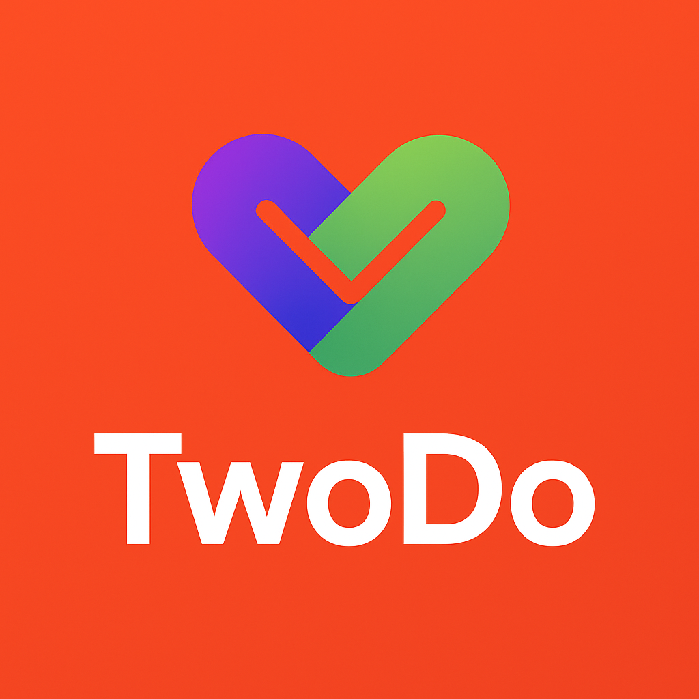

<a id="readme-top"></a>

# [](https://github.com/danielgithiomi/two-do) TWODO

> Developed by <a href="https://github.com/danielgithiomi">Daniel Githiomi</a>

## 📋 <a name="table">Table of Contents</a>

1. 🤖 [Description](#-description)
2. 👀 [Preview](#-preview)
3. 🛠 [Tech Stack](#-tech-stack)
4. 🔋 [Application Features](#-application-features)
5. 🤸 [Quick Start](#-quick-start)
6. ⚙️ [Maintainers](#-maintainers)
7. 📱 [Contacts](#-contact)
8. 🪪 [Licenses](#-licenses)

---

## 🤖 DESCRIPTION

**TwoDo** is a personal bucket-list application designed for couples and friends to create, share, and track activities. Users can add adventures, mark them as completed, attach photos, and track progress across multiple lists.

This monorepo includes:

- **Backend**: Spring Boot with PostgreSQL and JWT authentication.
- **Web frontend**: Next.js application.
- **Mobile frontend**: React Native app for iOS and Android.

The project focuses on building a modern, cross-platform experience while maintaining secure and scalable backend architecture.

---

## 👀 PREVIEW

Below is a glimpse of the application. Screenshots have been added for each platform to give a preview.

<!-- 
 -->

---

## 🛠 TECH-STACK

Technologies used to develop this project:

- **Backend**: Java 17, Spring Boot, PostgreSQL, Docker
- **Web**: Next.js, React, TypeScript, Tailwind CSS
- **Mobile**: React Native, Expo, TypeScript
- **DevOps**: Turborepo, Docker Compose

<div>
  
  
  
  
  
</div>

---

## 🔋 APPLICATION FEATURES

👉 **Create Bucket Lists**: Add personal or shared lists to track adventures.

👉 **Add Activities**: Insert activities with descriptions, locations, and optional photos.

👉 **Mark as Done**: Complete activities and track progress automatically.

👉 **Shared Experiences**: Invite friends or partners to view and edit lists.

👉 **Cross-Platform**: Access via web, Android, and iOS with responsive design.

👉 **Secure Login**: JWT authentication with hashed passwords for safety.

---

## 🤸 QUICK START

Follow these steps to set up the project locally:

### 1️⃣ Clone the repository

```bash
git clone https://github.com/danielgithiomi/two-do.git
cd two-do
```

### 2️⃣ Install dependencies

#### Backend

```bash
cd apps/backend
./mvnw clean install   # Maven
# or
./gradlew build        # Gradle
```

#### Web

```bash
cd ../web
npm install
# or
yarn install
```

#### Mobile

```bash
cd ../mobile
npm install
# or
yarn install
```

### 3️⃣ Environment variables

Create a `.env` file in the root directory of the project with the following variables:

Backend .env variables

```bash
SPRING_DATASOURCE_URL=jdbc:postgresql://localhost:5432/twodo
SPRING_DATASOURCE_USERNAME=twodo
SPRING_DATASOURCE_PASSWORD=twodo123
JWT_SECRET=your_jwt_secret
```

### 4️⃣ Run the application locally

#### Backend

```bash
./mvnw spring-boot:run
# or
./gradlew bootRun
```

#### Web

```bash
cd ../web
npm run dev
```

#### Mobile

```bash
cd ../mobile
npx expo start
```

### 5️⃣ Access the application

- Web: http://localhost:3000
- Mobile: http://localhost:19006

---

## ⚙️ MAINTAINERS

- [Daniel Githiomi (Dhosio)](https://github.com/githiomi)

---

## 📱 CONTACT

Contact me through any of the following channels:

- Website: [portfolio](https://danielgithiomi.com)
- GitHub: [githiomi](https://github.com/githiomi)
- LinkedIn: [danielgithiomi](https://linkedin.com/in/daniel-githiomi/)
- Email: [gmail](danielgithiomi@gmail.com)

---

## 🪪 LICENSES

Click the following to access my license page: [License](https://githiomi.github.io/Privacy-Policy/)

> Copyright (c) {2025} DhosioLux.

<p align="right"><a style="text-decoration: none;" href="#readme-top">⬆️</a></p>